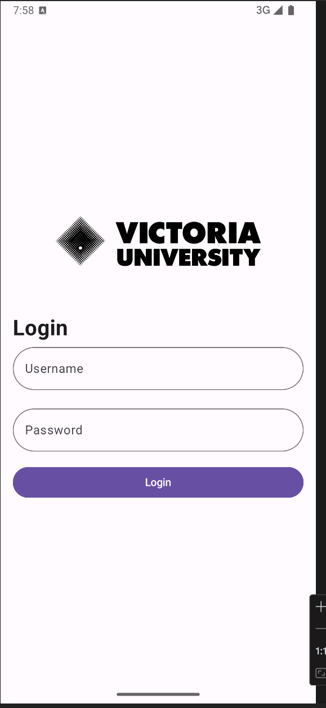
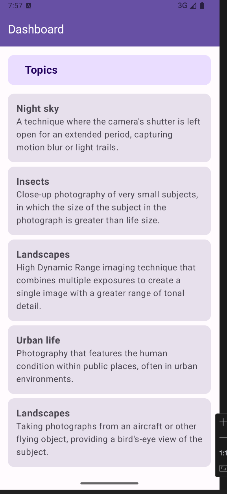
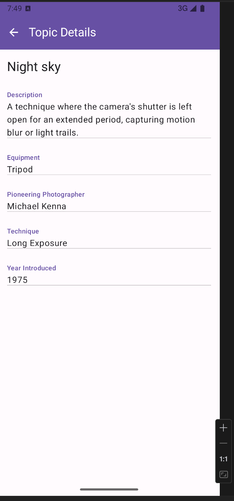

# Student Login App

This is a Kotlin-based Android application that provides a simple login interface for students and a dashboard that displays a list of related topics.

## Features

- **Login Screen**: A user-friendly login screen where students can enter their username and password to gain access to the application.
- **Dashboard**: After a successful login, users are taken to the dashboard where they can view a list of topics with brief descriptions.
- **Details**: A click on a list item will navigate to the details that shows more information about the topic.
  
## Screenshots

### Login Screen


### Dashboard


### Details


## Project Structure


## Setup Instructions

1. **Clone the repository**:
    ```bash
    git clone https://github.com/your-repo/student_login.git
    ```
2. **Open the project in Android Studio**:
   - Open Android Studio and select the cloned project directory.

3. **Sync Gradle**:
   - Gradle build scripts are written in Kotlin DSL (`.kts`), so ensure you have the latest Android Gradle Plugin installed.
   - Sync the project with Gradle to download dependencies.

4. **Run the app**:
   - Connect a physical device or start an emulator, then click on the "Run" button in Android Studio to install and launch the app.

## Dependencies

- **Kotlin**: The project is fully written in Kotlin, leveraging Kotlin's modern language features.
- **Hilt**: Used for Dependency Injection to manage object creation and dependencies.
- **ViewModel**: Part of Android's Architecture Components, used to manage UI-related data in a lifecycle-aware way.
- **Retrofit**: For API requests to fetch the list of topics from the server.
  
## API

The app fetches topics from the following API endpoint:
```
https://nit3213-api-h2b3-latest.onrender.com
```

